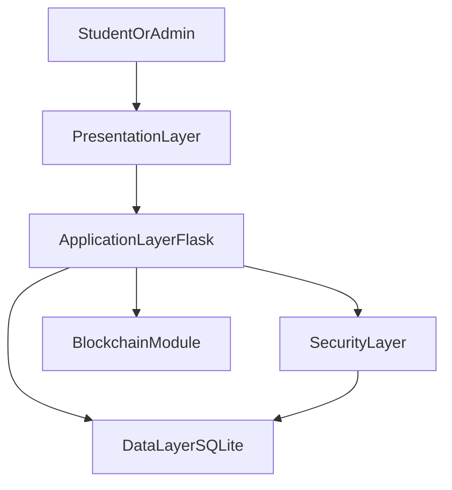

# SecureChain – A Secure Blockchain Wallet for Campus Payments

## 1. System Overview
SecureChain is a beginner-friendly secure web wallet built for educational use in a university computer security project. It enables students to register, authenticate, send and receive campus tokens, and view transaction history, while administrators can monitor users, transactions, and security logs.

The solution demonstrates practical secure system development by combining:
- Flask backend application logic
- SQLite persistent storage
- A simple blockchain-inspired ledger for tamper-evident transaction chaining
- Security-first coding practices (hashing, RBAC, session controls, validation, encryption, logging)

The target use case is campus micro-payments, such as cafeteria purchases, library fines, and peer token transfers.

---

## 2. Problem Statement
Campus payment workflows are often fragmented and difficult to audit. Systems that lack secure authentication, role separation, and transaction integrity controls expose institutions to fraud, impersonation, and data tampering risks.

SecureChain addresses this by implementing a small, demonstrable secure wallet platform with:
- robust user identity protection,
- controlled role-based access,
- tamper-resistant ledger linkage, and
- accountable audit trails.

This project is designed for teaching secure coding and cyber defense principles rather than deploying a production cryptocurrency.

---

## 3. System Design
SecureChain follows a modular, layered design:
- **Frontend:** HTML/CSS templates and small form validations.
- **Backend:** Flask routes and service functions in `app.py`.
- **Blockchain Module:** hash-linked block creation and validation in `blockchain.py`.
- **Database:** SQLite tables for users, transactions, and logs.

### Functional Flow
1. User registers (password hashed with bcrypt).
2. User logs in (session established).
3. User sends tokens (validated, authorized, balance checked).
4. Transaction creates a new block with previous-hash linkage.
5. DB stores transaction and logs action.
6. Admin monitors integrity and activity trail.

---

## 4. System Architecture
### Layered Architecture


### Data Flow for Token Transfer

```mermaid
flowchart LR
    sendPage[SendPage] --> validate[ValidateInputAndSession]
    validate --> fundsCheck[CheckReceiverAndBalance]
    fundsCheck --> createBlock[CreateHashLinkedBlock]
    createBlock --> chainCheck[VerifyChainIntegrity]
    chainCheck --> updateDb[UpdateUsersAndInsertTransaction]
    updateDb --> writeLog[WriteAuditLogs]
    writeLog --> result[ReturnSuccessToUI]
```


---

## 5. Security Features
SecureChain implements all requested controls:

1. **Password Hashing (bcrypt)**
   - Passwords are never stored as plaintext.
   - Salted bcrypt hashes are used in registration/login verification.

2. **Authentication**
   - Session-based login with protected routes.
   - OTP-based two-factor verification at `/verify-otp`.
   - Access denied if session or OTP verification fails.

3. **Authorization (RBAC)**
   - Roles: `student`, `admin`.
   - Admin dashboard restricted to admin role.

4. **Input Validation**
   - Username pattern checks.
   - Positive numeric amount checks.
   - Receiver existence and anti-self-transfer validation.
   - Parameterized SQL to prevent SQL injection.

5. **Session Management**
   - Secure session usage with inactivity timeout.
   - Forced logout and re-authentication after timeout.

6. **Transaction Logging**
   - Important events captured with timestamps:
     login, logout, transfer, unauthorized access attempts.

7. **Blockchain Integrity**
   - SHA-256 hash per block.
   - Previous-hash linkage enforces chain continuity.
   - Validation checks detect tampering.

8. **Encryption**
   - Transaction sender, receiver, and amount are encrypted at rest with Fernet.

9. **Error Handling**
   - Safe user-facing messages.
   - No sensitive trace leakage in templates.

10. **Audit Trail**
   - Logs table stores chronological action evidence.
   - Additional accountability with `failed_logins` and `alerts`.

---

## 6. Implementation Details
### Main Files
- `app.py`: Flask app, routes, auth/session/RBAC, DB operations, logging.
- `blockchain.py`: Block and Blockchain classes, genesis, chain validation.
- `templates/*.html`: Register, login, dashboard, send, transactions, admin.
- `static/style.css`: UI styling.

### Blockchain Block Fields
Each block contains:
- index
- timestamp
- sender
- receiver
- amount
- previous_hash
- hash

### Genesis Block
The blockchain automatically creates a genesis block at startup when no chain exists.

### Secure DB Access
All queries use parameter placeholders (`?`) to avoid SQL injection risks.

---

## 7. Database Design
### users
- `id` INTEGER PRIMARY KEY AUTOINCREMENT
- `username` TEXT UNIQUE NOT NULL
- `password_hash` TEXT NOT NULL
- `role` TEXT NOT NULL (`admin` or `student`)
- `balance` REAL NOT NULL
- `created_at` TEXT NOT NULL
- `wallet_address` TEXT

### transactions
- `id` INTEGER PRIMARY KEY AUTOINCREMENT
- `sender` TEXT (legacy nullable)
- `receiver` TEXT (legacy nullable)
- `sender_enc` TEXT
- `receiver_enc` TEXT
- `amount_enc` TEXT
- `hash` TEXT NOT NULL
- `timestamp` TEXT NOT NULL

### logs
- `id` INTEGER PRIMARY KEY AUTOINCREMENT
- `user` TEXT NOT NULL
- `action` TEXT NOT NULL
- `timestamp` TEXT NOT NULL

### alerts
- `id` INTEGER PRIMARY KEY AUTOINCREMENT
- `user` TEXT NOT NULL
- `amount` REAL NOT NULL
- `reason` TEXT NOT NULL
- `timestamp` TEXT NOT NULL

### failed_logins
- `id` INTEGER PRIMARY KEY AUTOINCREMENT
- `username` TEXT NOT NULL
- `timestamp` TEXT NOT NULL
- `ip_address` TEXT NOT NULL

---

## 8. Testing Plan
The formal test list is provided in `tests/test_plan.md`.

Mandatory validation areas:
- Login success/failure
- Valid and invalid transfers
- Input validation rejection
- Session timeout behavior
- Unauthorized access prevention
- Blockchain consistency checks
- Password hash verification
- OTP verification (success/fail/expiry)
- Fraud detection alerts
- Failed login tracking
- Encryption/decryption correctness
- PDF report generation

Testing should include both positive and negative cases, plus security-oriented misuse scenarios.

---

## 9. Evaluation Results
### Expected Outcomes
- Users can securely register and log in.
- Token transfers update balances correctly.
- All transactions are recorded with hash references.
- Chain integrity status remains valid under normal use.
- Admin can audit activity and detect abnormal behavior.
- Admin security dashboard provides monitoring metrics and system health.

### Security Evaluation
- **Confidentiality:** Passwords hashed; sensitive metadata encrypted.
- **Integrity:** Hash-linked blocks and validation checks detect tampering.
- **Availability:** Simple, lightweight local stack easy to run in class demos.
- **Accountability:** Logs provide non-repudiation support for user actions.

### Limitations (Educational Scope)
- Single-node local blockchain (not decentralized consensus).
- SQLite local storage (not distributed/high-availability).
- Minimal frontend framework for beginner accessibility.

---

## 10. User Manual
### Installation
1. Open terminal in `blockchain_wallet/`.
2. Install dependencies:
   ```bash
   pip install -r requirements.txt
   ```
3. Run application:
   ```bash
   python app.py
   ```
4. Open browser at `http://127.0.0.1:5000`.

### First Login
- Admin account is auto-seeded:
  - Username: `admin`
  - Password: `admin123!`

### Student Workflow
1. Register a new student account.
2. Login.
3. View dashboard balance.
4. Send tokens to another student on `/send`.
5. Review history on `/transactions`.
6. Verify blockchain using nav link.
7. Download PDF report.
8. Logout.

### Admin Workflow
1. Login as admin.
2. Open `/admin`.
3. Review users, encrypted transaction summaries, alerts, and logs on `/admin`.
4. Open `/admin/security` to inspect security metrics and failed login telemetry.
5. Export full audit report PDF.

### Classroom Demo Script
1. Register two students (`alice`, `bob`).
2. Login as `alice`, send tokens to `bob`.
3. Show updated balances and transaction history.
4. Login as admin and show:
   - transaction entry,
   - audit logs,
   - blockchain validity.
5. Demonstrate unauthorized access by opening `/admin` as student.
6. Demonstrate session timeout by waiting inactivity period.

---

## Appendix A: Innovation and Real-World Relevance
SecureChain demonstrates a practical campus-payment concept:
- cafeteria token checkout,
- student-to-student settlement,
- library fine collection,
- transparent transaction proof with hash-linked records.

This ties blockchain concepts directly to a manageable real-world security problem suitable for beginner teams.

## Appendix B: Secure Development Practices Followed
- least privilege via RBAC
- secure defaults for protected routes
- fail-safe validation and error handling
- parameterized SQL only
- audit-oriented logging
- modular separation (`app.py` vs `blockchain.py`)

